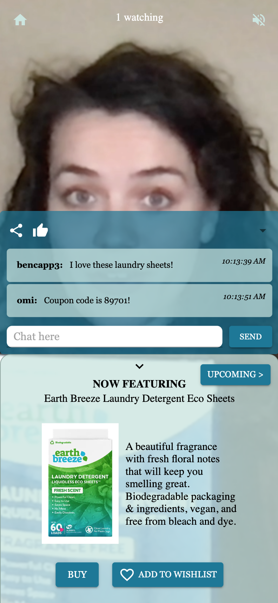

# Omi Live Shopping

## Description

_Duration: Two week sprint_

Omi Live Shopping is a one-of-a-kind, green-first streaming platform that connects you with a community of eco-conscious shoppers who are passionate about supporting environmentally friendly businesses. Our platform provides an interactive experience where you can live stream your product, answer questions from viewers in real-time, and receive a sales commission on each purchase made during your stream. Omi Live Shopping is committed to showcasing authentic, sustainable products and practices and building trust between viewers and content creators.

---

## **TABLE OF CONTENTS:**

1. Screenshots
1. Installation
1. Usage
1. Technologies used
1. Acknowledgements
1. Contact

## Screenshots

<div style={{display: 'flex'}}>
  
  
  
  
  
</div>

## Installation

1. Download [OBS](https://obsproject.com/)

1. Create a database named `omi_live`. If you would like to name your database something else, you will need to change `omi_live` to the name of your new database name in `server/modules/pool.js`
1. The queries in the `database.sql` file are set up to create all the necessary tables. The project is built on [Postgres](https://www.postgresql.org/download/), so you will need to have that installed. We recommend using [Postico 2](https://eggerapps.at/postico2/) to run those queries.
1. Open up your editor of choice and run an `npm install` to install the necessary dependencies.
1. Create a `.env` file at the root of the project and paste this line into the file:

```
SERVER_SESSION_SECRET=superDuperSecret
```

While you're in your new `.env` file, take the time to replace `superDuperSecret` with some long random string like `25POUbVtx6RKVNWszd9ERB9Bb6` to keep your application secure. Here's a site that can help you: [https://passwordsgenerator.net/](https://passwordsgenerator.net/). If you don't do this step, create a secret with less than eight characters, or leave it as `superDuperSecret`, you will get a warning.

1. Run `npm run server` in your terminal
1. Run `npm run client` in your terminal

## General Usage

1. Begin by creating an account with a username and password. Follow best practices for password security (some guidelines can be found [here](https://www.liquidweb.com/blog/password-security-best-practices/)). Login with these credentials.
1. A new account will default to be a Viewer account. If you want your account to be a Streamer/Admin account, you will need to go into Postico (or wherever you are running your database) and change the isAdmin column from FALSE to TRUE. Save your changes.

### Viewer Usage

1. When you login, you will first be brought to the home page and the Watch tab. If there is not a livestream happening, you will see "Sorry there are no streams currently available." If a livestream is happening, you will see a preview of the video and a "Join" button. Click this button to join the stream.
1. In the livestream, you will see the video, the chat panel, and the product panel.
1. In the product panel, you can see the current product being featured in the stream, the option to purchase the product on an external site, or add the product to your wishlist for later. You can also see which products will be featured next in the stream.
1. In the chat panel, you can send questions and comments to the streamer and other audience members in real time.
1. From the home page, you can also take a look at all of the products under the Products tab, or view the items you have saved in your Wishlist.

### Streamer Usage

1. When you login, you will first see a list of Streams that you have created. You can click these streams to see more details about the stream.
1. You can create a new stream from the home page by clicking the Create New Stream button. Enter the title, description, and choose a date for the stream.
1. Once you have created your stream, you can add products that will be featured in the stream, either by creating a new product or choosing one already entered in the app.
1. After selecting the products, you can reorder or delete products from the stream.
1. Once you have finalized your products, you can click "Go Live" to enter the livestream controls page. (You will also need to start streaming on OBS - please see OBS Instructions).
1. On the Livestream page, you can change which product you are currently featuring to the audience, view, send, and delete chats to audience members in the chat panel, and end the stream once you are finished.
1. From the home page, you can view all products in the products tab. On the page for an individual product, you can edit the information or delete the product from the app entirely. You can also choose to make a product visible to viewers on the app by checking the Public checkbox.

## Technologies used

- React
- Redux
- Redux-Sagas
- Javascript
- HTML
- CSS
- Express.js
- Passport
- Node.js
- Postico 2
- PostgreSQL
- Material UI
- Node Media Server
- Socket.io

## Acknowledgements

A huge thanks to our client Summer Lee for the idea and vision behind OMI Live Shopping. Thank you to Dane Smith and [Prime Digital Academy](www.primeacademy.io) for the training, support, and guidance through the process of building this application.

## Contact

This project was developed by Andrea Love, Zak Abdi, Solomon Lambert, and Ben Capp. If you would like to get in touch with us, we can be reached via LinkedIn:
[Andrea](https://www.linkedin.com/in/andrearlove/)
[Zak](https://www.linkedin.com/in/zakariye/)
[Solomon](https://www.linkedin.com/in/sollambert/)
[Ben](https://www.linkedin.com/in/bencapp/)
